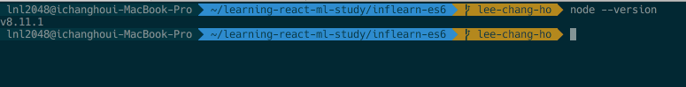
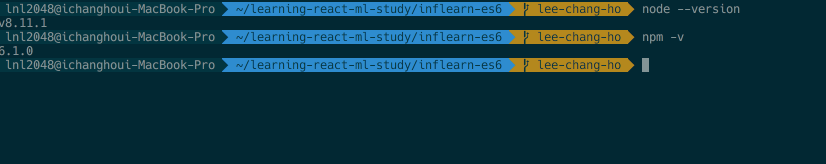
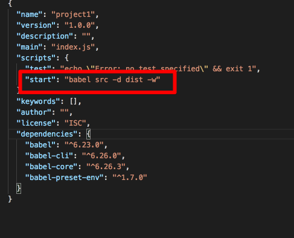

# node와 npm 그리고 ES6 환경 설정 

# node.js의 개념
[node.js의 공식사이트](https://nodejs.org/en/)에서의 정의
> Node.js®는 Chrome V8 JavaScript 엔진으로 빌드된 JavaScript 런타임입니다. Node.js는 이벤트 기반, Non 블로킹 I/O 모델을 사용해 가볍고 효율적입니다. Node.js의 패키지 생태계인 npm은 세계에서 가장 큰 오픈 소스 라이브러리 생태계이기도 합니다.

`node.js`는 자바스크립트 기반으로 구성된 서버 서비스를 자바스크립트로 구현 할 수 있게 만든 것이고 npm은 `node.js`기반으로 한 모듈 집합 저장소이다. npm은 Node Package Manger 라고 불린다. 

`npm`은 자바스크립트로 개발된 오픈 소스를 모듈로 올려놓은 곳이다. 우리는 웹 개발에 필요한 온갖 모듈들을 npm을 통해 쉽게 다운 받고 쓸 수 있다. 

# node.js와 npm 설치
1. 우선 [node 공식 사이트](https://nodejs.org/en/)가서 LST 버전을 클릭하여 다운 받는다.(현재  작성일 기준으로 8.11.3 LTS) 윈도우와 맥 모두 동일

2. 설치가 완료되면 터미널에서 `node --version`을 치고 다운 받은 버전이 확인 되면 성공


3. 노드가 별 문제 없이 설치 되었다면 다시 터미널(배쉬)에서 `npm -v`를 타이핑 해 보면 현재 설치 되어있는 npm 버전이 확인 된다 


4. 업그레이드는 조금 복잡하므로 담 기회에..^^

# ES6 환경 설정 
현재 모든 브라우저에서는 ES6를 지원해 주지 않는다. 그렇기 때문에 ES6로 작성된 코드를 이전의 문법인 ES5로 트랜스파일하여 배포해야 하는 경우가 발생한다. 이걸 하는 역할이 바로 babel 이라는 npm 모듈이다. 

1. 프로젝트 생성하기
npm을 이용하여 프로젝트를 생성해야 한다. 
```
npm init- y
```
라는 명령어로 프로젝트를 초기화 한다. 

2. 우선, 방금 설치한 npm을 이용하여 바벨 관련 모듈들을 설치한다. 
```
npm install babel babel-core babel-preset-env babel-cli --save
```
> 여기서 npm 설치시 붙는 --save 명령어는 현재 프로젝트 폴더 에서만 이 모듈을 사용하겠다는 옵션이다.

3. .babelrc 작성 
 - 바벨을 사용하기 전에 우선  .babelrc 라는 파일을 생성하여 ES2015 프리셋을 작성하여야 한다.
```json
{
  "presets": [
    "env"
  ]
}
```
4. test
 - src 폴더를 생성하고 그 안에 index.js 를 만든다. 
 -  index.js에 ES6로 된 코드를 작성한다.
 ```javascript
const hello = 'hello'
let arr = [1, 2, 3]
 ```
 - 프로젝트 폴더 내에 npm init -y로 생성된  package.json 파일을 다음과 같이 변환한다. 
 

 - 터미널에서 아래 명령어를 실행한다
 ```
npm run start
 ```

그럼 dist 폴더가 생성되면서 ES6 코드가 아래 ES5 코드로 변환된다. 
```javascript
'use strict';

var hello = 'hello';

var arr = [1, 2, 3];
```

